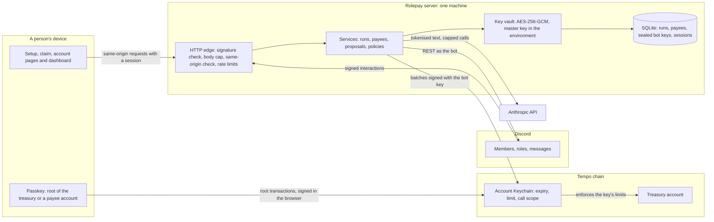

# Rolepay threat model

What Rolepay protects, from whom, and how. Every mitigation below names the code or the test that implements it. Where something is not mitigated, this document says so.

Paths: `core/` is `packages/core/src/`, `discord/` is `packages/discord/src/`, `web/` is `packages/web/src/`, `server/` is `apps/server/`. Other paths are from the repository root.

## 1. Scope and summary

**In scope:** the code in this repository (`packages/core`, `packages/discord`, `packages/web`, `apps/server`), run as the testnet demo (`fly.demo.toml`) or the prepared mainnet server (`fly.app.toml`).

**Out of scope:** Tempo's protocol and nodes, Discord, Anthropic, Fly.io, and the security of people's devices and passkey managers. Rolepay relies on them, and this document says where.

**Summary.** Rolepay is built so that the server is never trusted with the treasury.

- The treasury is the community's own Tempo account. Its root key is the treasurer's passkey, which signs in the browser. The server never holds it.
- The server holds one access key per community. The chain restricts that key: an expiry, a spending limit per period on the payout token, and one allowed call (`transferWithMemo` on the payout token).
- So the worst a fully compromised server can do with the bot key is spend the key's limit once per period, as memo'd transfers of the payout token, until the key expires or the treasurer revokes it. The chain enforces that bound. `packages/core/test/protocolLimit.chain.test.ts` proves the limit on Moderato with Rolepay's own checks skipped, and `packages/core/test/protocolKey.chain.test.ts` proves the call scope and the revocation the same way.
- Everything else (who may approve, never paying twice, the checks on AI proposals, the policy guardrails) is enforced by Rolepay's code. It protects against mistakes, outages and people without access to the server. It does not hold against someone who controls the server.

The largest accepted risk: the setup page's JavaScript is served by the same server that holds the bot key. A fully compromised server could serve a page that asks the treasurer's passkey to sign something else (T15).

## 2. Assets

| Asset | Where it lives | Protected by |
| --- | --- | --- |
| Treasury funds | The community's Tempo account | The treasurer's passkey (the root key). The bot key's on-chain limits. |
| Bot access key secret | SQLite (`bot_keys`), sealed | AES-256-GCM with the community and key as associated data (`core/adapters/crypto/keyVault.ts`). The master key is an environment secret, not in the database. The secret is destroyed when the key is revoked or replaced. |
| Who is paid where (a Discord user's address) | SQLite (`payees`) | One-time claim links. The address comes from the passkey session the server verified, never from the page. |
| Claim and setup links | SQLite | Only an HMAC fingerprint of each token is stored (`core/services/payeeService.ts`, `core/services/communityService.ts`). Claim links work once; setup links for 30 minutes. |
| Dashboard sessions | KeyValueStore (the SQLite file) | Stored under a SHA-256 of the token, for 8 hours, each with its own CSRF token (`web/dashboard/sessions.ts`). |
| Passkey sessions | KeyValueStore (the SQLite file) | One hour (`web/passkeys.ts`). Stored by the Accounts SDK under the raw token (see section 7). |
| Passkey public keys | KeyValueStore (the SQLite file) | Public by nature. Kept because a returning sign-in does not send them. |
| Server secrets: the Discord bot token, the OAuth client secret, the Anthropic API key, the master key | Environment (Fly secrets; locally the gitignored `.env`) | Not in git (`.gitignore`). Error logs drop URLs, which can hold API keys (`server/src/logging.ts`). |
| Message text read for AI proposals | Memory, for one request. Proposals in the KeyValueStore for a day. | Off by default. User IDs replaced by tokens. Never logged (`core/services/proposalService.test.ts`). |
| The audit log | SQLite (`audit_events`), append-only | Codes, amounts and IDs only, never anyone's words. |
| Funding records (the treasury's virtual-address master, funding sources, deposits) | SQLite (`deposit_masters`, `funding_sources`, `deposits`) | Public chain data, plus each source's name (user text, never audited or logged). They hold no money and no key: a deposit lands in the treasury on chain whatever these say. |

## 3. Actors

| Actor | Can | Cannot |
| --- | --- | --- |
| Treasurer (the approver role and the treasury passkey) | Approve runs and policies. Authorise, replace and revoke the bot key. Move treasury funds from `/account`. | |
| Admin (Manage Server, without the approver role) | Run setup, create runs. | Approve, or change who approves, the fee mode or four eyes (`canChangeApprovalRules` in `core/domain/community.ts`). |
| Proposer role (optional) | Propose runs and write policies with AI. | Approve them. |
| Payee | Register through their link, receive, send from `/account`. | |
| Server member | Write messages that an AI proposal may read. | Propose or approve. Core re-checks roles on every call. |
| Anyone on the internet | Reach `/discord/interactions`, the pages, `/webauthn/*` and `/auth/*`. | Forge a Discord interaction without Discord's signing key, or pass the same-origin check from another site. |
| Database reader (a leaked snapshot or backup) | Read every row. | Open sealed bot keys or match link tokens without the master key. |
| Anyone in full control of the server | Everything the server can do, including signing with the bot key. | Spend more than the key's on-chain limit, call anything but `transferWithMemo` on the payout token, or sign with the treasury passkey. |
| The model (Claude, through Anthropic's API) | Return a proposal. | Approve, sign or pay. Code checks its output, and a proposal is only a draft. |
| Anyone who knows a deposit address | Send TIP-20 tokens to it, which credits the treasury. | Take anything from the treasury through it, or make a deposit address pay anyone. |
| Tempo RPC and sponsor, Discord, Anthropic | Answer requests. | Rolepay trusts the RPC's answers about the chain (T3, T29). |

## 4. Trust boundaries

1. **Discord to the server.** Every interaction carries an Ed25519 signature. Roles and permissions come from the signed interaction, never from anything else the request says.
2. **The browser to the server.** POSTs must be same-origin. Pages act through a passkey session or a dashboard session. The server derives addresses from the verified passkey, never from the page.
3. **The browser to the chain.** The treasurer's passkey signs root transactions (authorise, replace, revoke) in the browser. The server only reads the result from the chain.
4. **The server to the chain.** The server signs only with the bot key. The Account Keychain enforces that key's restrictions, whatever the server does.
5. **The server to Anthropic.** Message text goes out with user IDs replaced by tokens, within a daily cap. The answer is untrusted input.
6. **The server to its database.** Bot key secrets are sealed. Link tokens and dashboard session tokens are stored hashed.

## 5. Threats and mitigations

| # | Threat | Mitigation | Code or test | Residual risk |
| --- | --- | --- | --- | --- |
| T1 | The bot key leaks and is used to drain the treasury. | The key is limited on chain: an expiry, a limit per period on the payout token, and `transferWithMemo` on that token as the only call. The protocol checks the limit transfer by transfer, across a batch, and reverts the whole batch. The treasurer revokes or replaces the key with one passkey prompt; replacing revokes the old key in the same transaction. | `core/domain/community.ts` (`keyAuthorization`), `web/client/keychain.ts` (`buildAuthorization`, `rotationCalls`). Tests: `packages/core/test/protocolLimit.chain.test.ts`, `packages/core/test/protocolKey.chain.test.ts` (calls outside the scope and a revoked key's transaction, refused by the chain), `server/e2e/passkeys.spec.ts` (the scope read back from the chain, the old key revoked on chain). | Up to one limit per period until the key expires or is revoked. A key valid for several periods can spend once per period. |
| T2 | A run is paid twice: a double click, a retry, a crash, two workers or a second machine. | Compare-and-set on the run's version. The signed transaction is stored before it is broadcast. Every attempt has a `validBefore` deadline, and a new attempt waits until the last one can no longer land. The chain head is read before the memo search. One lease per run. | `core/adapters/sqlite/repositories.ts` (`update`), `core/services/payRunService.ts`, `core/adapters/kv/runLeases.ts`. Tests: `core/services/payRunService.test.ts`, `packages/core/test/rolepay.sqlite.integration.test.ts`, `packages/core/test/rolepay.chain.test.ts` (crash recovery on Moderato). | Assumes the RPC tells the truth (T3). |
| T3 | A lying or broken RPC hides a transaction that landed. | Only the chain-ID check at start. | `server/src/chainCheck.ts` | **Not mitigated.** The run can read `not_landed`. An approver who then presses Retry pays it again, up to the key's remaining limit. |
| T4 | The server runs against the wrong network. | It refuses to start when the RPC's chain ID is not the configured network's. Mainnet needs `ROLEPAY_ALLOW_MAINNET=true`. Config refuses the dev shortcuts and demo controls off Moderato. Chain tests refuse any chain but Moderato. | `server/src/chainCheck.ts`, `core/config/env.ts`, `server/src/config.ts`. Tests: `server/src/chainCheck.test.ts`, `server/src/config.test.ts`, `server/test/flyConfig.test.ts`. | None known. |
| T5 | A run is larger than the key's remaining budget, or the key is revoked or about to expire. | A pre-flight before signing reads the key from the chain (`checkKeyForRun`). The protocol refuses an over-limit batch and a revoked key's transaction anyway. | `core/domain/community.ts`, `core/adapters/tempo/tempoPayoutChain.ts` (`keyState`). Tests: `packages/core/test/rolepay.chain.test.ts` (`insufficient_limit` before signing), `packages/core/test/protocolLimit.chain.test.ts`, `packages/core/test/protocolKey.chain.test.ts`. | None: the chain is the backstop. |
| T6 | Someone without the approver role approves a run. | The Approve button checks the approver role in the signed interaction; core checks again. Optional four eyes refuses the run's creator. | `discord/components/runButtons.ts`, `discord/app/permissions.ts`, `core/services/payRunService.ts` (`approve`). Test: `discord/components/runButtons.test.ts`. | Whoever can give a member the approver role in Discord can approve. Bounded by the key's limit. |
| T7 | Manage Server alone makes itself the approver, or changes fees or four eyes. | Those changes need a member who holds the current approver role. | `core/domain/community.ts` (`canChangeApprovalRules`), `core/services/communityService.ts` | The change is shown only to the person who made it, not posted publicly. |
| T8 | Forged or replayed Discord interactions, and floods of them. | An Ed25519 signature over the timestamp and body, at most 5 minutes old. Each interaction ID is answered once; a replay gets 409. Bodies over 1 MB are refused. Requests that fail the signature check are limited per client (10, then one every 5 seconds); a client over that gets 429 before its body is read or any signature checked. A request that passes the check never counts, since Discord sends every server's interactions from the same addresses. | `discord/http/verify.ts`, `discord/http/handler.ts`, `server/src/compose.ts` (`MAX_BODY_BYTES`, `defaultInteractionLimit`). Tests: `discord/http/verify.test.ts`, `discord/http/handler.test.ts`, `server/test/server.test.ts` (valid requests never limited, even in bulk; 429 after 10 bad ones with no signature work; other clients unaffected; Fly-Client-IP). | Junk from many addresses costs one signature check per request: there is no overall budget, because junk could spend it for Discord too. A request with no client address (no proxy in front) is not limited. In memory per process (T21). |
| T9 | Cross-site requests against the pages or the dashboard (CSRF). | Every POST must be same-origin (`Origin` and `Sec-Fetch-Site`). Dashboard forms also carry a per-session CSRF token. Cookies are `SameSite=Lax`. | `web/app.ts`, `web/dashboard/access.ts` (`actionAccess`). Tests: `web/dashboard/auth.test.ts`, `server/test/dashboard.test.ts`. | None known. |
| T10 | Script injection through names, notes, policy text or summaries. | A strict CSP: one script from this origin, styles by hash, connections only to this origin, the RPC and the sponsor, no framing. Every string a person or Discord controls is escaped. The dashboard runs no script. | `web/app.ts` (`contentSecurityPolicy`). Tests: `web/dashboard/escaping.test.ts`; the Playwright specs fail on any CSP violation. | None known. |
| T11 | Dashboard sign-in attacks: login CSRF, session fixation, a stolen session. | OAuth2 code flow with PKCE (S256) and a state bound to an HttpOnly cookie. A new session at every sign-in. Session tokens kept as SHA-256 only. `__Host-` cookies on https. The Discord token is revoked straight away. | `web/dashboard/sessions.ts`, `web/dashboard/routes/auth.ts`, `web/dashboard/cookies.ts`, `web/dashboard/discordOAuth.ts`. Tests: `web/dashboard/auth.test.ts`, `server/e2e/dashboard.spec.ts`. | Sessions last 8 hours whatever the activity. |
| T12 | A role removed in Discord keeps working on the dashboard. | Every action re-reads the member's roles from Discord and hands them to core, which checks them again. Roles in a form are ignored. | `web/dashboard/access.ts`, `web/dashboard/members.ts`. Test: `web/dashboard/members.test.ts`. | Page reads (never actions) trust a role for up to a minute. |
| T13 | Someone takes over a treasury on the setup page. | A treasury is bound once. Later actions need the treasury passkey's own session, proven by a sign-in assertion, because a registration with attestation "none" proves nothing. | `web/routes/setup.ts` (`provesPasskey`), `web/passkeys.ts` (`withLoginProof`). Test: `web/routes/setup.test.ts`. | None known. |
| T14 | The server answers the setup page with a bigger key authorisation than the treasurer typed. | The page builds the authorisation from the form and refuses to sign if the server's copy differs in any field. | `web/client/keychain.ts` (`authorizationMismatch`). Tests: `web/client/keychain.test.ts`, `server/e2e/passkeys.spec.ts` (a tampered answer: "Nothing was signed", no passkey prompt). | Holds against a tampered answer, not against tampered page code (T15). |
| T15 | A fully compromised server serves altered setup or account page code. | None in code. Accepted for the small mainnet pilot (`server/MAINNET.md`, "Risks accepted for the pilot"). | | **Not mitigated.** Bounded by the treasury (the setup page) or by what a payee holds (the account page). |
| T16 | Pay goes to the wrong address. | Recipients register through a one-time link. The server stores only a fingerprint of it and takes the address from the passkey it verified, never from the page. | `core/services/payeeService.ts`, `web/routes/claim.ts`. Test: `web/routes/claim.test.ts`. | Whoever opens a claim link first registers their passkey for that member. The link is shown only to that member. |
| T17 | Prompt injection through channel messages. | Messages are data in an escaped `<messages>` block. Code checks every line whatever the model says: lines backed only by the recipient's own message, messages that try to instruct the AI, amounts the instruction does not state, lines over the budget. A proposal is a draft that needs the normal approval, and the key caps it. | `core/adapters/anthropic/prompts.ts`, `core/domain/proposal/proposal.ts`. Tests: `core/domain/proposal/proposal.test.ts` (the injection suite), `packages/core/test/anthropic.live.test.ts` (opt-in). | The model can misread an instruction. The treasurer reads the lines before approving. |
| T18 | Message text and identities reach the model. | Off until a treasurer turns it on. Only the approver or proposer role can propose. User IDs and mentions become tokens. Criteria mode never sends members or messages. Logs keep counts and cost, never text. | `core/domain/proposal/sources.ts` (`pseudonymizeMessages`), `core/domain/community.ts` (`canPropose`). Test: `core/services/proposalService.test.ts`. | Names typed as plain text reach Anthropic as written. |
| T19 | Running up the AI bill. | At most `ROLEPAY_AI_DAILY_CAP` model calls per UTC day per server (50 by default), counted atomically in the database, so a restart keeps the count. | `core/adapters/kv/proposerDailyCap.ts`, `core/adapters/wiring.ts` | One proposer can use up the day's calls for every community on the server. |
| T20 | A standing policy pays more than intended, or pays with nobody looking. | The AI compiles the rule once. Only the current approver role approves each version. No AI at runtime. Autopilot has a veto window and re-checks the approver before each payment. Caps per run and per person. A run over the budget is held whole. One run per policy and period. A daily schedule (the testnet demo's judge payouts) exists only with the demo controls, which config refuses off Moderato, and core refuses it without them; a "never paid" rule never pays someone who is paid or being paid. | `core/services/policyService.ts`, `core/services/schedulerService.ts`, `core/domain/policy/`, `core/domain/proposal/criteria.ts` (`paidPayees`). Tests: `core/services/schedulerService.test.ts`, `packages/core/test/policies.sqlite.integration.test.ts`, `server/test/policiesDashboard.test.ts`, `server/test/judgeDemo.test.ts`, `packages/core/test/policy.chain.test.ts`. | Bounded by the key's limit, like any run. |
| T21 | Flooding the public endpoints. | Token buckets per client and per endpoint group for POSTs to `/webauthn`, `/claim`, `/setup` and `/dashboard`, and for every request under `/auth/`; on `/discord/interactions`, per client for requests that fail the signature check only (T8). The client key is Fly's `Fly-Client-IP` behind Fly. Bodies over 1 MB are refused. | `web/app.ts` (`rateLimitGroup`), `server/src/compose.ts` (`defaultRateLimits`, `defaultInteractionLimit`, `MAX_BODY_BYTES`) | In memory per process. Anyone can register passkeys within the limits. |
| T22 | Fees silently eat the payout budget. | Fees come from the sponsor or from a separate fee-budget token with its own limit. Config refuses a fee token equal to the payout token. | `server/src/config.ts`, `web/client/fees.ts`. Tests: `packages/core/test/feeBudget.chain.test.ts`, `server/e2e/mainnetPath.spec.ts`, `web/client/fees.test.ts`. | A fee budget smaller than one run's fee passes the pre-flight; the run then fails as retryable and nothing is sent. |
| T23 | A spreadsheet formula in a CSV export. | Cells that start with `=`, `+`, `-`, `@`, a tab or a carriage return are defused. | `core/domain/csv.ts` | None known. |
| T27 | Money is taken out through a deposit address (funding with attribution, TIP-1022). | Nothing to take: a deposit address is not an account. The TIP-20 precompile resolves it to the treasury inside the transfer and credits the treasury, or reverts; the virtual address never holds a balance and nobody holds a key for it. A deposit address can only ever add money. The registration grants no key or allowance, and a masterId's master can never be changed (TIP-1022 has no rotation), so nobody can redirect it later. | Tempo's protocol (`docs/tempo/tip-1022.md`, invariants 1 to 4). Test: `packages/core/test/funding.chain.test.ts` (each deposit raises the treasury by exactly its amount in its own block; the deposit addresses hold nothing; the treasury sends nothing). | None known. |
| T28 | Attribution spoofing: someone sends to a source's deposit address to make it look funded, or credits a deposit to the wrong source. | A deposit is recorded only from the protocol's two-hop pattern: a Transfer to one of the community's deposit addresses followed, in the same transaction, by a Transfer of the same token and amount from that address to the treasury (`attributeDeposits`). The treasury paying its own deposit address (self-forwarding) is not counted. The sender is stored and shown beside the source. Unknown tags and other masters are never attributed. | `core/domain/funding.ts` (`attributeDeposits`). Tests: `core/domain/funding.test.ts`, `core/services/fundingService.test.ts`. | **By design**, attribution says which address money arrived at, not who sent it: anyone can send to any deposit address, so "from Acme DAO" means "to Acme DAO's address". The money is real either way: it is in the treasury. The Funding page says so and lists the sender. |
| T29 | The deposit watcher trusts the RPC: a lying RPC invents deposits or hides them. | Only the chain-ID check at start. The watcher moves no money and signs nothing; a deposit record is a label on money the chain already holds. | `core/services/fundingService.ts` (`scan`), `server/src/chainCheck.ts` | **Not mitigated.** A lying RPC can make the Funding page wrong (a deposit that never happened, a missing one). Balances (the Treasury card, the explorer) are read separately. Nothing pays because of a deposit record. |
| T30 | The setup page signs a different registration than it means (a tampered server answer). | The page mines the salt and builds `registerVirtualMaster(salt)` itself, compares the server's masterId, master, contract and calldata, and signs nothing on any difference. Even a different salt could only register another masterId for this same treasury: the registry binds the sender. Core records a master only when the registry maps it to the treasury. | `web/client/deposits.ts` (`buildRegistration`, `registrationMismatch`), `core/services/fundingService.ts` (`confirmMaster`). Tests: `web/client/deposits.test.ts`, `web/routes/setupDeposits.test.ts`, `server/e2e/depositAddresses.spec.ts` (a tampered plan: "Nothing was signed", no passkey prompt). | Holds against a tampered answer, not against tampered page code (T15). |
| T31 | Someone else registers the treasury's masterId first (front-running the registration). | TIP-1022's 32-bit proof of work over a 4-byte masterId: a targeted collision costs about 2^64 work. The plan checks the masterId is free; confirm checks the registry maps it to the treasury, so a stolen one is never recorded (the treasurer sets up again with a new salt). | `core/services/fundingService.ts` (`planMaster`, `confirmMaster`) | None known. |
| T32 | The setup page's CSP is relaxed for mining. | Only `/setup/` pages allow `'wasm-unsafe-eval'` (WebAssembly compilation, not JavaScript eval) and `worker-src blob:`; scripts still come only from this origin, so both can only be used by our own bundle. Every other page keeps `script-src 'self'` and no workers. | `web/app.ts` (`contentSecurityPolicy`). Test: `web/app.test.ts`. | An XSS on the setup page (none known, T10) could also run WebAssembly. |
| T33 | Money sent to a deposit address in a token Tempo does not forward. | The Funding page and the Discord reply say: only TIP-20 stablecoins on Tempo. | `web/dashboard/views/funding.ts`, `discord/views/funding.ts` | **Not mitigated (protocol limit).** A non-TIP-20 token sent to a deposit address, or a transfer on another chain, is lost; a TIP-20 Rolepay does not watch still lands in the treasury but is not attributed. |

## 6. What the chain guarantees, and what the code guarantees

**The chain (Tempo's protocol), whatever Rolepay's code does:**

| Guarantee | Shown in this repository |
| --- | --- |
| The bot key's limit holds per period on the payout token, transfer by transfer and across a batch. A transfer over it reverts the whole transaction. | `packages/core/test/protocolLimit.chain.test.ts`: a batch sent with no pre-flight and no simulation landed and reverted whole, the third transfer failing with the Account Keychain's `SpendingLimitExceeded`. |
| A batch is atomic: all transfers or none. | The same test: transfers 1 and 2 ran and were undone. |
| Only the treasury's root key (the passkey) can authorise, replace or revoke keys, since Rolepay never creates an admin key. A limited key cannot raise its own limit. | Tempo's specification (`docs/tempo/protocol_transactions_AccountKeychain.md`). Rotation and revocation by the passkey are in `server/e2e/passkeys.spec.ts`. |
| The key may call only `transferWithMemo` on the payout token. | `packages/core/test/protocolKey.chain.test.ts`: signed by the bot key with no pre-flight and nothing simulated, a plain `transfer` of the payout token, a `transferWithMemo` on pathUSD (which the key may spend, but only on fees) and an `approve`, each within the key's limits, landed and reverted with the Account Keychain's `CallNotAllowed`, and nothing moved; the in-scope call, sent the same way, landed. The scope is also read back from the chain in `server/e2e/passkeys.spec.ts`. |
| A revoked or expired key cannot sign anything that lands. | Revoked: `packages/core/test/protocolKey.chain.test.ts`. After the root revoked the key, a transfer it signed by hand was refused at submit (`keychain validation failed: KeyAlreadyRevoked`) and nothing moved; the same transfer landed before the revocation. Expired: Tempo's specification; no test sends a transaction with an expired key. |
| A transaction cannot land after its `validBefore` (an expiring nonce, up to five minutes ahead). | Tempo's specification (`docs/tempo/protocol_upgrades_t11.md`). "Never pay twice" relies on it. |
| A TIP-20 transfer to a deposit address credits the treasury in the same transaction, or reverts; the deposit address never holds a balance; a masterId's master never changes. | `packages/core/test/funding.chain.test.ts`: two deposits from an account that knows nothing about Rolepay, each raising the treasury by exactly its amount in its own block, with the two Transfer hops in its receipt, the deposit addresses at zero and the treasury sending nothing. Permanence: TIP-1022 (`docs/tempo/tip-1022.md`). |

**Rolepay's code, which holds only while the server is honest:**

- Who may approve, and four eyes (T6, T7).
- Never paying twice (T2).
- The pre-flight before a run (T5).
- The checks on AI proposals, the daily cap and the pseudonymisation (T17 to T19).
- Policy approvals, veto windows and caps other than the key's limit (T20).
- Recipients registered through one-time links (T16).
- Sessions, CSRF, CSP and rate limits (T8 to T13, T21, T32).
- Which funding source a deposit is attributed to, and recording it once (T28, T29). Not where the money goes: that is the chain's (T27).

Against someone who controls the server, only the first table holds, and the key's limit is the bound.

## 7. Known limits and what we would do next

| Limit | Why it matters | What we would do next |
| --- | --- | --- |
| **Passkey sessions.** The Accounts SDK (`accounts` 0.19.1, `Handler.webAuthn`, wired in `web/passkeys.ts`) stores each session under its raw token (`webauthn:session:<token>`), and its `accounts_webauthn` cookie has no `__Host-` prefix. Dashboard sessions are hashed and prefixed (T11). | A database reader could present a live passkey session (at most an hour old). The impact is small: the setup and claim endpoints also need a link token, which is stored only as a fingerprint, and nothing moves on chain without the passkey signing in the browser. | Hash the session key inside `accountsKv` (the SDK reads and writes through it), and name the cookie with the `__Host-` prefix on https. |
| **A lying RPC** (T3). | An RPC that hides a landed transaction lets a run read `not_landed`. An approver who presses Retry pays it again, up to the key's remaining limit. The only check is the chain ID at start (`server/src/chainCheck.ts`). | Before calling an attempt dead, confirm against a second, independent RPC, and refuse a new attempt when they disagree. |
| **Roles** (T6). | Whoever can assign the approver role in Discord can approve runs. Discord's own permissions decide that. | Optional passkey-confirmed approval for runs above a threshold. An on-chain recipient allowlist is already supported (`KeyPolicy.recipients`) but off by default, because adding a payee then needs a passkey prompt. |
| **The vault.** The master key (an environment secret) and the sealed bot keys are on the same machine. | The vault protects against a database-only leak (a snapshot, a backup), not against a full server compromise. | Unseal through a key management service, or move signing to a separate signer, so the database and the server's disk are not enough. The on-chain limit is the bound either way. |
| **The setup and account page code** comes from the bot server (T15). | A fully compromised server could serve a page that asks a passkey to sign something else. | Serve those pages as an immutable bundle from a separate static origin that the bot server cannot change (`docs/ARCHITECTURE.md`, known limits). |
| **Rate limits are in memory per process** (T21). | A restart resets them, and a second machine would have its own. | Keep the buckets in the shared database once there is more than one machine. |
| **Expiry is not exercised on chain** (section 6). | The call scope and revocation are now tested on Moderato (`packages/core/test/protocolKey.chain.test.ts`); that an expired key's transaction is refused is still only Tempo's documented behaviour. | Authorise a key that expires a few seconds out, wait, and send a transaction signed by it, in the same test. |
| **One machine, one region.** | A deploy or a crash means about 20 seconds without answers. The recovery sweep finishes anything in flight. | A second instance on the same database is already safe for payments and policies (leases, compare-and-set, one run per period). A second machine needs the shared database first: the Postgres move in `docs/ARCHITECTURE.md` ("Persistence"). |
| **The treasury passkey is the only key to the treasury.** | Lose it and the funds stay in the account for good. | Keep the treasury small and use a synced passkey (`server/MAINNET.md`). A multisig root later. |
